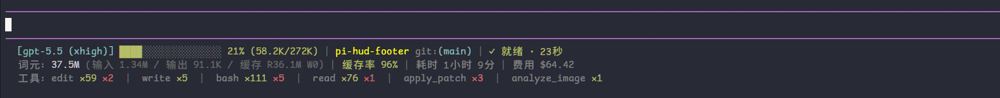
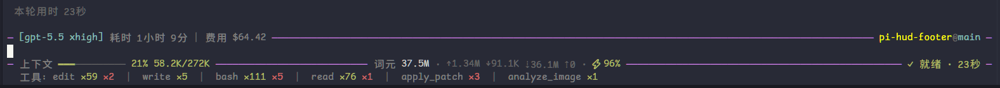

# pi-hud-footer

English | [简体中文](README.md)

A Claude HUD style custom footer/statusline extension for [pi coding agent](https://github.com/earendil-works/pi).

> **Fork notice**: this repository is [Agents365-ai](https://github.com/Agents365-ai)'s fork of upstream [liao666brant/pi-hud-footer](https://github.com/liao666brant/pi-hud-footer) 0.7.0 (MIT). On top of the upstream features it adds a tmux jobs line and an rtk / MCP / project memory extras line. [FORK.md](FORK.md) lists the differences and the way to follow upstream.
>
> Install: `pi install git:github.com/Agents365-ai/pi-hud-footer@v1.0.0`, or `pi install npm:@agents365-ai/pi-hud-footer@1.0.0` once the npm release exists.
> Try it in one project: `pi -e .`

It keeps model, context, token, cache, cost, tool-call, and running-state information visible near the bottom of the TUI. The default is the `classic` footer style. You can also switch to the `border` editor-border style, which embeds stable HUD information into the input editor borders and leaves only dynamically growing tool statistics in the footer.

## Highlights

- Shows the current model, thinking level, project name, and git branch
- Shows context usage, cumulative token usage scoped to the session tree or active branch, output rate, cache read/write tokens, and cache hit rate
- Supports aggregate or latest-request cache hit rates
- Shows running / ready state, session elapsed time, and estimated cost; turn duration notifications are opt-in
- Displays costs in USD or CNY, with a customizable USD-to-CNY rate that defaults to `6.8`
- Shows tool-call statistics while keeping footer height stable
- Shows the tmux jobs line: panes on the `pi-agent` socket tagged with `PI_HUD_OWNER`, at most three rows, with the entry count set by `jobsMax`
- The extras line shows rtk savings of this session, MCP server and tool counts, and the project memory entry count, and hides each segment whose source is absent
- Supports two HUD styles: `classic` footer style and `border` editor-border style
- Supports Chinese and English UI text, selected automatically from the system language by default
- Supports global and project-level JSON configuration

## Themes / Styles

| Style | Alias | Best for | Description |
|---|---|---|---|
| `classic` | `1` | Default theme | Displays HUD information below the input box and keeps the classic three-line footer experience. |
| `border` | `2` | Border layout | Embeds model, elapsed time, cost, context usage, token metrics, and state into the input editor borders. Tool statistics stay in the footer line for a more stable layout. |

Switch and save the style from the TUI:

```text
/hud-footer-theme
```

The command writes to the configuration file. If the current trusted project already has `.pi/hud-footer.json`, it saves to the project config; otherwise it saves to the global config at `~/.pi/agent/hud-footer.json`. You can also set it manually:

```json
{
  "style": "classic"
}
```

### `classic` / `1`: classic footer style



### `border` / `2`: editor-border style



## Installation

Install from GitHub, pinned to a tag:

```bash
pi install git:github.com/Agents365-ai/pi-hud-footer@v1.0.0
```

Once the npm release exists, install from npm:

```bash
pi install npm:@agents365-ai/pi-hud-footer@1.0.0
```

For local development or debugging, install from a local path:

```bash
pi install /path/to/pi-hud-footer
```

Load the repository directly without installing:

```bash
pi -e .
```

The base extension comes from upstream [liao666brant/pi-hud-footer](https://github.com/liao666brant/pi-hud-footer); the fork notice at the top lists this fork's differences.

## Commands

| Command | Description |
|---|---|
| `/hud-footer` | Toggle the HUD footer on or off for the current session. |
| `/hud-footer-reload` | Reload configuration and refresh the HUD footer. |
| `/hud-footer-theme` | Open a TUI selector, switch the HUD style, and save it. |
| `/hud-footer-language` | Open a TUI selector, switch the UI language, and save it. |
| `/hud-footer-currency` | Open a TUI selector, switch the cost display currency, and save it. The exchange rate stays a config-file setting. |

## Configuration

Full configuration reference: [docs/CONFIG.en.md](docs/CONFIG.en.md)

Example configuration: [examples/hud-footer.json](examples/hud-footer.json) / annotated JSONC: [examples/hud-footer.jsonc](examples/hud-footer.jsonc)

| Level | Path | Notes |
|---|---|---|
| Global | `~/.pi/agent/hud-footer.json` | Applies to all sessions. |
| Project | `.pi/hud-footer.json` | Read only when the project is trusted, and overrides global configuration. |

### Options

| Option | Description |
|---|---|
| `enabled` | Enable the HUD footer. |
| `language` | UI language: `auto` / `zh` / `en`. |
| `style` | HUD style: `classic` / `border`. |
| `display` | Widget visibility rules, with global and per-style overrides. |
| `cacheRateMode` | Cache hit rate: aggregate (`total`) or latest request (`latest`). Defaults to `total`. |
| `currency` | Cost display currency: `USD` / `CNY`. Defaults to `USD`; `/hud-footer-currency` switches it too. |
| `exchangeRate` | USD-to-CNY exchange rate. Defaults to `6.8` (1 USD = 6.8 CNY). |
| `barWidth` | Context progress bar width. |
| `maxTools` | Maximum number of tools shown in the tool summary. |
| `jobsMax` | Maximum number of panes shown in the tmux jobs line. Defaults to `10`; live panes come first. |
| `usageScope` | Cumulative token and cost scope: active branch (`branch`) or complete session tree (`session`). Defaults to `branch`. |

`display` supports the `all`, `classic`, and `border` groups. Available keys: `toolsLine`, `modelName`, `thinkingLevel`, `projectName`, `gitBranch`, `context`, `tokens`, `tokenBreakdown`, `tokenRate`, `cacheRate`, `elapsed`, `cost`, `state`, `turnDuration`, `rtkSavings`, `mcpStatus`, `memoryCount`.

`turnDuration` is disabled by default to avoid duplicate per-turn duration notifications from other extensions. Set it to `true` to enable it.

`rtkSavings`, `mcpStatus`, and `memoryCount` control the three segments of the extras line. All three are visible by default, and each one hides itself when its data source is absent. See the extras line section of [docs/CONFIG.en.md](docs/CONFIG.en.md) for the details.

After changing configuration, run this in pi:

```text
/hud-footer-reload
```

Or:

```text
/reload
```

## Metrics

Token metrics use these icons:

| Icon | Meaning |
|---|---|
| `↑` | Input tokens |
| `↓` | Output tokens |
| `R` | Cache read tokens |
| `W` | Cache write tokens |
| `⚡` | Cache hit rate |

`R` / `W` are hidden independently when their value is `0`.

`usageScope` determines whether ↑/↓/R/W and cost accumulate over the complete session tree or the active branch. The `session` mode includes assistant messages, tool results with usage, usage records such as cache warming, compactions, and branch summaries. Context usage and tool statistics remain scoped to the effective context and active branch, respectively.

`tokenRate` shows the main agent's current streaming output rate, computed from output-token deltas over the last 0.5-2 seconds.

`cacheRateMode` selects either the latest assistant request (`latest`) or aggregate usage (`total`) within the active scope; `latest` uses the last assistant request in that scope, `total` the cumulative value. Cache hit rate formula:

```txt
cacheRead / (input + cacheRead + cacheWrite)
```

Meaning: cached input tokens / total input-side tokens.

The extras line carries three segments: rtk savings of this session, MCP server and tool counts, and the project memory entry count; each segment hides itself when its source is absent. The tmux jobs line shows panes on the `pi-agent` socket tagged with `PI_HUD_OWNER`, each rendered as `name(command)`, at most three rows, with the entry count set by `jobsMax`, live panes first, and the overflow marked `+N` at the end of the line. See [docs/CONFIG.en.md](docs/CONFIG.en.md) for the collection timing, source files, and edge cases.

## Development / temporary loading

Load without installing:

```bash
pi -e ./pi-hud-footer
```

From inside this repository:

```bash
pi -e .
```

After making changes, run this in pi:

```text
/reload
```

## Publishing

See the "Install and publish" section of [FORK.md](FORK.md).

## Security

pi extensions run with your system permissions. This extension makes no network requests, but it reads local files and runs a few commands:

- it reads pane information on the `pi-agent` socket through `tmux -L pi-agent list-panes`, which reads no files;
- it reads `~/.pi/agent/mcp.json`, `~/.pi/agent/mcp-adapter.json`, `~/.pi/agent/mcp-cache.json`, and the project memory store under `~/.pi/agent/memory/<slug>/`;
- it runs `rtk gain -f json` and `git rev-parse --show-toplevel`.

## Support

If this extension is helpful, consider supporting the author:

<table>
  <tr>
    <td align="center"><br><b>WeChat Pay</b></td>
    <td align="center"><br><b>Alipay</b></td>
    <td align="center"><br><b>Buy Me a Coffee</b></td>
    <td align="center"><br><b>Give a Reward</b></td>
  </tr>
</table>

## Author

**Agents365-ai** · [Bilibili](https://space.bilibili.com/441831884) · [GitHub](https://github.com/Agents365-ai)

## License

MIT
